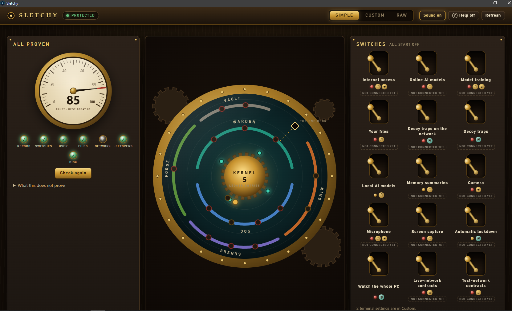
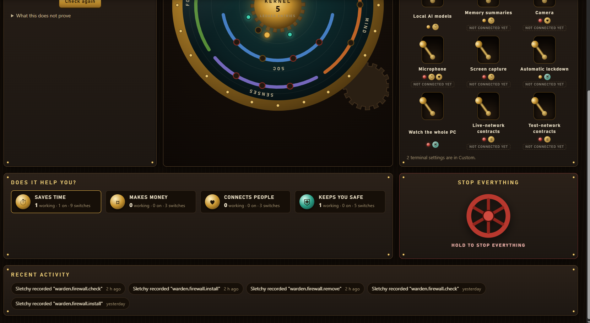
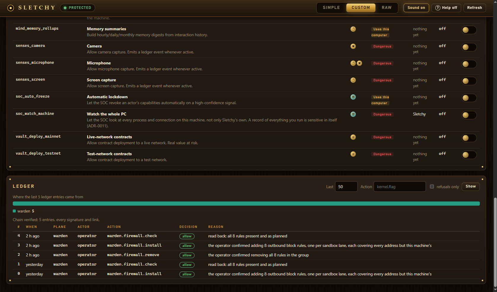
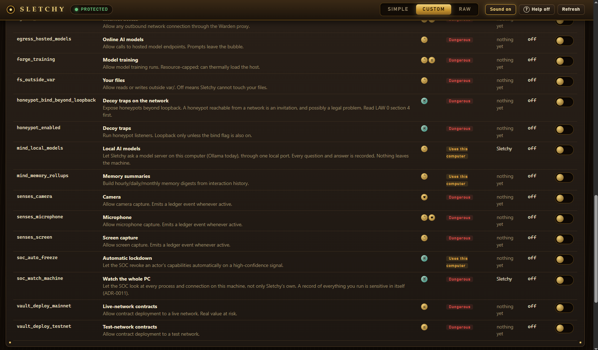
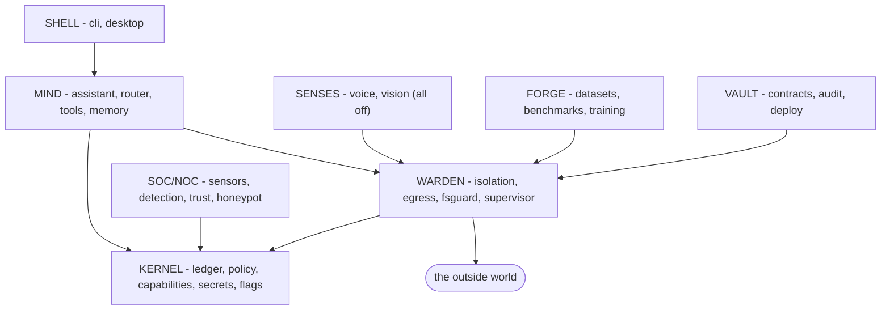

# Sletchy

*Placeholder repo name: `unnamed project evelution v0.0.001`*

A **sealed personal enclave** - a private network-and-compute bubble with a SOC/NOC at
its centre, running a local-first assistant that learns from its user and gates
everything that happens inside itself, including its own behaviour.

Private. Single-user. One machine. Offline-capable.

> **In build, not released.** The code is here to be read: what is built, how it is tested,
> and every gap it still has ([COVERAGE](tests/adversarial/COVERAGE.md)). There is nothing to
> install yet. **No licence has been chosen**, so it may be read but not reused; the release
> is planned under Apache-2.0. It is provided as is, with no warranty of any kind. To report
> a security problem, see [SECURITY.md](SECURITY.md).
>
> **This repository is a snapshot** of my private development repository, published so the
> work can be read. Issue and pull request numbers in these files (#123) refer to that one,
> and its links are not public. My notes on an older, private archive of projects
> (`docs/salvage/`) are left out of it.

---



**Simple.** The trust meter, the seven planes around the Kernel, and every switch, all starting off.

<details>
<summary><b>More of the window</b> (three more screens, from Simple and Custom)</summary>

<table>
<tr><td width="50%"><br><sub>Simple, lower half. What each switch is for, the Stop everything valve (held, never clicked) and the latest from the record.</sub></td><td width="50%"><br><sub>The ledger. Every entry signed and chained, and the chain checked as you look at it.</sub></td></tr>
<tr><td width="50%"><br><sub>Every switch. What it allows, its risk, and what reads it today. Most say *nothing yet*.</sub></td><td width="50%"></td></tr>
</table>

</details>

---

> **This README is the manual.** It is written to be read top to bottom once, then used as
> a reference. It explains every word this project uses, what each part does, what runs
> today, and what is deliberately not built yet. If something here disagrees with the code,
> the code is right and this file is a bug - say so.

**Jump to:** [What it is](#1-what-this-actually-is) · [Five-minute tour](#3-five-minute-tour)
· [**The vocabulary**](#4-the-vocabulary) · [The seven planes](#5-the-mental-model-seven-planes)
· [Follow one action](#6-follow-one-action-all-the-way-through) · [The Kernel](#7-the-kernel-piece-by-piece)
· [The Warden](#8-the-warden-piece-by-piece) · [Will this break my PC?](#9-will-this-break-my-pc)
· [Working on it](#10-working-on-it) · [Repo map](#11-where-everything-lives)
· [Status](#12-status-what-actually-runs-today) · [**Deep dive: the engineering**](#13-under-the-hood---the-engineering)
· [Cheat sheet](#15-cheat-sheet)

---

## 1. What this actually is

Imagine a workshop with one door.

Everything that comes in or goes out passes through that door, and a camera records it -
what it was, who asked, whether it was allowed, and why. The recording is written in ink
that cannot be erased without visibly ruining every page after it. The person operating
the door is *also* on camera, and cannot grant themselves permissions.

That is Sletchy. The workshop is your computer. The door is the **Warden**. The camera and
its unerasable notebook are the **Kernel's ledger**. The assistant that eventually lives
inside the workshop is the **Mind**.

**The point is not the assistant.** Plenty of things are an assistant. The point is that
everything the assistant does is *visible, gated, and reversible* - including the things
it does that nobody anticipated.

### Three commitments, and what each one really means

1. **Nothing happens off-ledger.**
   Before an action takes effect, a record of it is appended to a tamper-evident log. Not
   after - before. If code can act without writing to the ledger, that is a bug, not an
   optimisation.
   *Why it's phrased that way:* a log written after the fact is a log that goes missing
   exactly when something crashes mid-action, which is exactly when you need it.

2. **Nothing is trusted.**
   Not the assistant, not the tools, not the models, not the prompts, not the packages
   from PyPI, and not Sletchy's own code. Trust is a score that moves on evidence, not a
   property something has permanently.

3. **Do no harm to the host.**
   This runs on your only computer. Everything is built around the fact that a crashed
   container costs you an afternoon and a bricked laptop costs you your income.

---

## 2. The one law that outranks everything

**[LAW 0 - Do no harm to the host machine.](docs/LAW/00-do-no-harm.md)** Read it before
you read anything else. When any other rule, goal, deadline, or interesting idea conflicts
with LAW 0, LAW 0 wins and the other thing does not get built.

In practice it means these things, none of which are negotiable:

| Rule | What it rules out |
|---|---|
| **No kernel-mode code** | No drivers, no filesystem filters, no boot-start services, and never Test Signing Mode |
| **Everything is reversible** | Every host change has an undo, and the undo ships in the *same* pull request |
| **Runs as a normal user** | Exactly one operation may ever ask for admin, and it is a separate, one-shot, prints-what-it-will-do step |
| **All state in one folder** | Everything Sletchy writes lives under `var/`. Uninstalling is: close it, run `sletchy stop`, delete the folder |
| **Limits before launch** | A process gets its memory and CPU ceilings *before* it starts, never after |
| **Fail closed, never fail destructive** | When unsure, refuse. But refusing never means deleting your data or "repairing" something |

### Why no kernel drivers - the arithmetic

This is the decision people push back on most, so here is the actual reasoning
([ADR-0001](docs/adr/0001-no-kernel-driver.md)):

| If something goes wrong | In user mode | In kernel mode |
|---|---|---|
| Null pointer bug | The process dies, restart it | **Blue screen** |
| Bad state early in boot | Nothing | **Boot loop, possibly unbootable** |
| How you recover | Kill the process | Safe Mode, or reinstall Windows |
| To load your own unsigned code | Nothing needed | **Turn off Test Signing - which disables the protections you are trying to add** |

That last row is the killer. Writing a "security driver" would require *weakening* Windows
security to install it. Net loss on day one.

**So how do we get real containment without a driver?** Windows already ships the
mechanisms, and they run in the kernel - you just drive them from user mode. Job Objects,
restricted tokens, AppContainer (the same sandbox that contains Edge), the Windows
Firewall COM API, and ETW for read-only observation. We get kernel enforcement without
shipping kernel risk. That is what the **Warden** is built on.

---

## 3. Five-minute tour

Everything below actually works today. Run it from the repo root.

```bash
uv sync --all-extras --dev
```

```bash
uv run sletchy init
```

Provisions a signing key into the Windows Credential Manager and creates `var/`. This is
the only setup step. It does not touch anything else on your machine.

```bash
uv run sletchy status
```

Verifies the whole ledger chain and prints what is enabled. If the chain does not verify,
this exits non-zero and Sletchy refuses to run - it will **not** quietly repair itself.

```bash
uv run sletchy ledger verify
```

The same verification on its own, for when you want just that answer.

```bash
uv run sletchy flags list
```

Every capability switch and its current state. On a fresh install, everything dangerous is
off. Try `--only-on` to see just what is enabled.

```bash
uv run sletchy flags set egress_enabled on --reason "trying it out"
```

Flips a switch. Dangerous flags **require** a reason, and the flip is written to the
ledger with who, when, and why. Try it without `--reason` and watch it refuse.

```bash
uv run sletchy stop --dry-run
```

Shows exactly what Stop everything would undo, changing nothing. Drop `--dry-run` to actually do
it: every flag back to default, every Sletchy firewall rule removed, every sandbox host
change reverted, runtime files cleared. It never prompts, and it never deletes your ledger
or your keys.

**What you cannot do yet:** talk to it. There is no chat, no model, no assistant. That is
deliberate and the reasoning is in [ADR-0003](docs/adr/0003-ledger-is-the-spine.md) - the
audit spine gets built before the thing it audits, because retrofitting an audit log onto
a working assistant never actually happens.

---

## 4. The vocabulary

This is the section to actually learn. Most confusion in this repo is vocabulary
confusion, and a lot of these words are Windows-security words that almost nobody knows
until they need them.

### 4.1 Kernel words - the trust root

| Word | What it means | Why you care |
|---|---|---|
| **Ledger** | An append-only log where every entry contains a hash of the previous entry | Edit entry 5 and entries 6, 7, 8… all stop verifying. You cannot quietly rewrite history |
| **Hash chain** | The mechanism above: each link commits to the one before | This is what makes the log *tamper-evident* rather than merely *tamper-discouraged* |
| **Seal** | A terminal entry that closes a log segment, committing to the whole segment's hash | Lets the log rotate at 4 MB without breaking the chain, and lets an open check a whole finished segment by one fingerprint |
| **Payload store** | Big bodies (prompts, responses) live in a separate content-addressed store; the ledger holds only their hash | The chain stays small, and you can delete a sensitive body *without* breaking verification |
| **Content-addressed** | A file's name **is** the hash of its contents | You cannot claim a payload is something it isn't, and identical content is stored once |
| **Policy** | Declarative rules over (who, what action, on what) → allow / deny / ask | The decision layer. Empty policy denies everything |
| **Verdict** | The recorded result of a policy decision, with its reason | Every verdict is a ledger entry. "Why did it refuse?" is always answerable |
| **Capability** | A short-lived, signed permission slip for exactly one action on exactly one subject, bound to one execution | An agent cannot ask for one. The Kernel issues them from policy. Anything else is prompt injection with extra steps |
| **Secret ref** | A *pointer* to a secret in the OS keychain - never the secret itself | Config files hold refs. If config leaks, nothing leaks |
| **Fail closed** | When a decision cannot be made confidently, refuse | The opposite is a system that works fine right up until it silently doesn't |
| **Flag** | A typed on/off switch for one capability | Everything dangerous defaults **off**. A dangerous flag that defaults on cannot even be constructed - the model rejects it |
| **Contract** | A Pydantic model defining a shape of data | Every schema in the project is one of these. Hand-writing a second copy of a schema is banned - drift in a security boundary is a vulnerability |

### 4.2 Warden words - enforcement

| Word | What it means | Why you care |
|---|---|---|
| **Isolation backend** | One way of confining a process. There are several, of different strengths | It's an *interface*, so Sletchy is not locked to Docker or anything else |
| **Sandbox** | A single confined execution: one backend, one workspace, one set of limits | |
| **Workspace** | The one directory a sandboxed process may read and write | Everything outside it is denied |
| **Job Object** | A Windows kernel object you put processes into, carrying hard limits on memory, CPU, and process count | This is how a runaway process cannot eat your RAM. Kill the job, the whole tree dies |
| **Restricted token** | A stripped-down copy of your security identity, with privileges removed | The sandboxed process runs as you, but a *weaker* you |
| **AppContainer** | Windows' built-in sandbox - the same one that contains Edge tabs and Store apps | With zero capabilities granted it denies the filesystem by default. This is the strongest thing available without a driver |
| **SID** | *Security Identifier.* The unique ID Windows uses for a user, group, or container | Each sandbox run gets its own throwaway SID |
| **ACE** | *Access Control Entry.* One line in a file's permission list: "this SID may do this" | An AppContainer is denied a folder until an ACE names its SID. This is why the sandbox has to be *handed* its workspace |
| **DACL** | The full permission list on a file or folder - a stack of ACEs | Adding an ACE is safe and additive. *Replacing* a DACL is how you accidentally lock yourself out of a directory, which is why this project shells out to `icacls` instead of assembling DACLs by hand |
| **Egress** | Any outbound network connection | Nothing in Sletchy connects out directly. Everything goes through one mediating proxy |
| **Allowlist** | A list of what is *permitted*, everything else refused | The opposite of a blocklist. Blocklists of dangerous things are unwinnable - there is always one more |
| **fsguard** | The filesystem confinement layer: canonicalise the path first, *then* check it's inside the root | Checking before resolving is the classic path-traversal bypass |
| **Supervisor** | The layer that decides whether a command may spawn at all | A denied command never starts. The decision happens before `CreateProcess` |
| **LOLBin** | *Living Off the Land Binary* - a legitimate Windows tool abused to run attacker code (`rundll32`, `mshta`, `regsvr32`) | These are explicitly rejected, because "it's a Microsoft-signed binary" is not a safety argument |

### 4.3 Process words - how this project is built

| Word | What it means | Why you care |
|---|---|---|
| **Plane** | One horizontal layer of the system: Kernel, Warden, SOC, Mind, Senses, Forge, Vault | Planes may only depend *downward*. Enforced by a CI test, not by discipline |
| **Wave** | A vertical slice of the roadmap that leaves the system working and honest | Waves are sequential because each one's guarantees depend on the last one's |
| **ADR** | *Architecture Decision Record* - a numbered document capturing a decision and its reasoning | So future-you arguing to change something has to argue with past-you who already thought about it |
| **Adversarial test** | A test shaped like an attack: "try to defeat this control" | These are the *primary* tests in this repo. Unit tests are secondary |
| **Conformance suite** | One shared set of tests every isolation backend must pass | It asserts *behaviour* ("this read is refused"), never implementation, so a backend can change substrate entirely and still be held to the contract |
| **Positive control** | A test that must **succeed**, proving the test rig actually works | Critical. A suite of "should fail" assertions passes perfectly when nothing runs at all. This project has been bitten by that three times - see below |
| **Residual gap** | A known weakness, written down in public | "Probably fine" is not a coverage claim. If it isn't tested, it goes on the list |
| **Tighten-only** | Policy may make a declaration stricter, never looser | A merge that would widen a limit is rejected and the component refuses to start |
| **Deny by default** | The answer to every unasked question is no | Test: if the policy file were empty, would this feature still do something? It should do nothing |

### 4.4 The positive-control lesson, because it keeps happening

Three times now, a test in this repo has "passed" while measuring nothing:

1. During the AppContainer spike, every probe wrote output to `NUL`. A contained process
   **cannot open `NUL`**, so every probe returned failure - including ones that should
   have succeeded. The first reading was "AppContainer denies everything". Wrong: the test
   was measuring its own output redirection.
2. Building `winjob`, a probe passed `""` as an argument. Windows escaped it, `start`
   couldn't find the program, and put up an **error dialog**. That dialog was a live
   process *inside the job*, so "something is alive in the job" was satisfied by a stuck
   message box.
3. The shared probes called `cat` and `sleep` by name. Sandboxed children get an empty
   `PATH`, so on Linux they never resolved and the suite reported "the sandbox cannot read
   its own workspace" - a probe failure dressed as a containment result.

**The rule that came out of it:** every isolation probe needs a positive control that must
succeed, and the control must be specific enough to catch the failure mode you didn't
think of. The tree-kill test now requires the job to *accrue CPU time*, because a blocked
dialog can be alive but a blocked dialog cannot burn CPU.

---

## 5. The mental model: seven planes



**Two structural rules, and everything else follows from them:**

1. **Nothing reaches the outside world except through the Warden.** Not the Mind, not the
   Senses. One membrane, one chokepoint. A raw `httpx` or `socket` import anywhere outside
   `warden/egress/` fails the build.
2. **Everything writes to the Kernel's ledger.** The SOC *reads* the ledger - it is not a
   second, parallel logging system. One source of truth means the security view and the
   audit view cannot disagree.

**Dependency direction is enforced, not requested.** `kernel` imports nothing from Sletchy
at all. `warden` and `soc` import only `kernel` - and they are siblings, so neither may
import the other. Everything above imports `kernel` + `warden`. Two separate mechanisms
check this (an import-linter contract and an AST scan), and there are deliberately-broken
fixture files proving the checks actually bite.

Full detail: [`docs/LAW/architecture.md`](docs/LAW/architecture.md).

---

## 6. Follow one action all the way through

### 6.1 Something that works today: flipping a flag

Run `uv run sletchy flags set egress_enabled on --reason "testing"` and here is what
happens:

1. The flag registry is consulted. `egress_enabled` is typed and marked **DANGEROUS**.
2. Because it is dangerous, a `--reason` is required. Without one, it refuses - the flip
   never happens.
3. **A ledger entry is appended first**, recording the flag, the old and new value, the
   reason, and a timestamp. It commits to the hash of the previous entry.
4. Only then is the flag state file written.
5. `sletchy status` will now show it as on, and `sletchy stop` will turn it back off.

Note the ordering in steps 3 and 4. If the process is killed between them, you get a
ledger entry for a flip that didn't happen - noise, and harmless. The other order would
give you a flip nobody recorded, which is the thing worth preventing.

### 6.2 Something that works today: running a command in a real sandbox

This is what `winjob` does, in order, on every single run:

1. Generate a throwaway context ID for this one execution.
2. **Write to the undo journal** - before creating anything.
3. Create an AppContainer profile named `Sletchy-<id>`. This is a real Windows identity
   with its own SID, living under your own `AppData\Local\Packages`.
4. **Journal again**, now recording the SID and the workspace about to be granted.
5. Grant that SID an ACE on the workspace - *after* checking the workspace isn't a drive
   root, a system folder, or a huge tree.
6. Create a Job Object and apply **every** limit: memory, CPU hard cap, max processes,
   kill-the-tree-on-close.
7. Create a restricted token with privileges stripped.
8. Launch the process **into the container and the job in the same system call**, with an
   allowlisted environment and a parent-opened handle for its output.
9. Wait. If it overruns, terminate the job - which kills the whole tree, not just the one
   process we were watching.
10. **`finally`:** kill the job, close the token, revoke the ACE, delete the profile,
    delete the capture file, clear the journal entry.

Step 8 matters more than it looks. The job is attached *at creation*, so there is no
instant - not even a short one - where the child is running without its limits. And if
the machine dies at any point, the journal tells `sletchy stop` exactly what to undo.

### 6.3 The design, not yet built: an agent calling a tool

Marked clearly because none of this exists yet - it's what Waves 3 and 4 build:

```
agent wants to call a tool
  → is the tool even in the registry it can see?   (capabilities intersect policy)
  → policy evaluates (actor, action, subject)      → allow / deny / ask
  → ledger records the verdict BEFORE anything runs
  → Warden picks an isolation backend at or above the required minimum
  → if that minimum is unavailable, the capability DOES NOT RUN. No downgrade.
  → tool runs sandboxed; every byte out goes through the egress proxy
  → SOC reads the ledger, scores trust, watches for patterns
```

The one rule to remember from that: **a capability whose minimum isolation is unavailable
does not run.** It never silently falls back to something weaker. That single rule is what
separates a security ladder from a security decoration.

---

## 7. The Kernel, piece by piece

`src/sletchy/kernel/` - the trust root. Small, boring, heavily tested, rarely changed.
It is the only thing everything else is allowed to assume.

### The ledger
Append-only, hash-chained, signed with a key from the Windows Credential Manager. Verified
on startup; a chain that doesn't verify **halts Sletchy**.

**There is no repair function, and none may be added.** A test literally walks every method
name on the `Ledger` class and fails if it finds `repair`, `rebuild`, `truncate`, `reset`,
`recover`, or `prune`. A quietly repaired audit log is worse than no audit log, because it
looks like evidence.

**One writer at a time.** The window's Kernel and a terminal command are two processes writing
one ledger. Each append holds an operating-system lock and first catches up with anything the
other wrote, so two writers can never fork the chain. Only `sletchy init` creates a ledger:
every other command, run in a folder with no Sletchy, says so and creates nothing.

### Policy
Rules over (actor, action, subject). Ties go to deny. An unparseable policy file denies
everything and raises rather than running unconfigured. Merging two policies can only ever
*narrow* the result - and the merge verifies its own output against both inputs, so a bug
in the merge cannot silently widen a bound.

### Capabilities
Short-lived, scoped, signed, bound to one execution context, checked at the moment of use.
The issuer's only public method is `issue()`, and its constructor *requires* a policy gate -
so there is no code path where something grants itself a permission.

### Secrets
Refs in config, values from the OS keychain, resolved at the moment of use, never logged
and never in a ledger payload. `resolve()` has **no `default=` parameter**, and a test
asserts the exact parameter list. That absence is the control: this project exists partly
because six API keys leaked across older projects through exactly one pattern - an
environment lookup with a real key as its fallback, which worked silently forever.

### Flags
One typed registry. Anything touching network, filesystem outside `var/`, microphone,
camera, screen, wallet, or training defaults to off. A `DANGEROUS` flag with `default=True`
**cannot be constructed** - the model validator rejects it. The test enumerates the *entire*
registry, not a sample.

The ledger outranks the file. A dangerous flag that `flags.json` says is on, with no ledger
entry turning it on - say, after someone edited the file by hand - reads as **off**, and
`status`, the window and the self-check name it. A flip whose file write fails is recorded as
not having happened, so the record and the switch never disagree.

---

## 8. The Warden, piece by piece

`src/sletchy/warden/` - the package that says no. Also the package most able to damage the
host, so LAW 0 applies here hardest.

### The isolation ladder

| Backend | How it confines | Needs | Strength |
|---|---|---|---|
| `inproc` | Not at all | - | **None.** Test-only, and it *refuses to load* outside a test run |
| `subproc` | Child process, scrubbed environment, timeout | - | Weak, and it says so |
| **`winjob`** | Job Object + restricted token + AppContainer | Windows | **Strong for filesystem, resources, and process tree** - the default |
| `container` | OCI: network namespace, read-only rootfs, cgroups | Docker *or* Podman | Strong (not built yet) |
| `vm` | Hyper-V isolated container | Hyper-V | Strongest (future) |

Policy declares a **minimum** per capability. If the minimum is unavailable, the capability
does not run - `select()` raises. There is deliberately no `allow_downgrade` parameter, and
a test asserts that no such parameter has been added.

### What `winjob` actually does - and what it does not

Everything in the "measured" column has a passing adversarial test on Windows 10 Pro
10.0.19045:

| Claim | Status |
|---|---|
| Denies reads outside the workspace | **Measured** - across drives, including your user profile |
| Workspace stays usable | **Measured** - a parent-placed file is readable, and the container can write |
| Limits applied before the process exists | **Measured** - as an ordering, not just an outcome |
| Kills the whole process tree | **Measured** - a *detached grandchild* dies with the job |
| Strips the environment | **Measured** - a credential in the parent never reaches the child |
| **Denies the network** | **NOT MEASURED - and therefore NOT CLAIMED** |
| **Denies the registry** | **NOT MEASURED** |
| Memory ceiling actually kills | Set before launch, but never observed firing |

**Read that network row carefully, because it is the single most important honesty rule in
this repo.** An AppContainer without the network capability is *expected* to be unable to
open a socket. Expected is not measured. So `winjob` does not claim `confines_network`, and
a test enforces that it doesn't. When you describe this system to anyone, say *"strong for
filesystem, resources, and process tree"* - never *"strong"*.

### Two counter-intuitive things about AppContainer

**It can run any program you can read, but then can't read anything.** Windows opens the
executable using *your* token, so the program starts fine - and then every file it tries to
open is denied. This is why Python cannot be the test probe: it launches and immediately
dies with `failed to locate pyvenv.cfg: Access is denied`.

**It is denied its own workspace until you hand it over.** A folder you created one second
earlier is invisible to the container until an ACE names its SID. Granting that ACE isn't
loosening the sandbox - it *is* how the sandbox gets its single usable area.

---

## 9. Will this break my PC?

The honest answer, in three parts.

### What is genuinely contained

Child processes that Sletchy launches. They get hard memory and CPU ceilings applied before
they exist, a filesystem they cannot escape, an environment with no credentials in it, and a
job object that kills the entire tree - including processes that detached from their parent
to try to survive.

### What is *not* contained, and you should know it

**Sletchy itself.** It runs as you, unsandboxed, with no memory or CPU cap of its own. A bug
in Sletchy's own code is still a bug running on your machine. That is precisely why LAW 0's
rails matter - no kernel code, no elevation, all state in one folder, everything reversible -
because those rails are the actual protection, not the sandbox.

The one operation capable of real damage is the recursive permission change on a sandbox
workspace (`icacls /T`). Pointed at a drive root or your home folder it would rewrite
permissions across the whole tree. It now refuses drive roots, UNC paths, non-directories,
unresolvable paths, anything that is or contains a protected system directory, and any tree
over 10,000 entries - and six tests assert that the permission tool is **never even reached**
on a refused target. A refusal that already started walking your disk is not a refusal.

### How to check for yourself, any time

```powershell
Get-ChildItem "$env:LOCALAPPDATA\Packages" -Filter "sletchy*"
```

Should return nothing. Every sandbox profile is deleted when its run ends, including runs
that crash partway through.

```powershell
(Get-ChildItem "$env:LOCALAPPDATA\Packages" -Directory).Count
```

Should be the same before and after any test run. On this machine it has been **117** across
every session so far.

```bash
uv run sletchy stop --dry-run
```

Shows what would be undone. And `uv run pytest -m law_zero` runs the 65 tests that assert
host safety mechanically - no elevation requested anywhere, nothing written outside `var/`,
no hardcoded paths uninstall can't reach, no registry writes, no boot persistence, and Stop everything
reverting from a deliberately corrupted state.

---

## 10. Working on it

### The loop

Everything ships through **issue → branch → PR → review → merge**. No direct commits to
`main` - a pre-push hook refuses.

```bash
git checkout -b wave2/egress-proxy      # or fix/..., docs/..., spike/...
```

### The verification gate - run all of this before claiming anything works

```bash
uv run pytest
```

```bash
uv run pytest -m law_zero
```

```bash
uv run pytest -m adversarial
```

```bash
uv run ruff check . && uv run ruff format --check .
```

```bash
uv run mypy
```

```bash
uv run lint-imports
```

```bash
uv run python scripts/secret_scan.py
```

### Commit shape

`type(scope): imperative subject`, body under 25 lines, bullets for *what changed* and
prose for *why*, ASCII only, and **always a `Verified:` line with real numbers**. Not
"tested thoroughly" - `450 passed, ruff clean, mypy clean on 75 files`.

Use `Closes #N` only for a full fix. Use `Refs #N` for a deliberate partial, and say what's
left. An open issue with a merged PR is not a mistake - it is the tracker correctly saying
there is work remaining.

Full conventions: [`docs/LAW/writing-conventions.md`](docs/LAW/writing-conventions.md).

### The folder that is read-only, absolutely

- **`Scraps and Parts/`** - ~19 archived projects, the archaeology this repo mines. Read it,
  learn, then rebuild from scratch. Never import, never copy a file, never write to it. It
  contains six old API keys (all six dead since 2026-10-08) and is gitignored in full.

---

## 11. Where everything lives

```
docs/
  LAW/          00-do-no-harm.md, laws.md, principles.md, architecture.md,
                isolation.md, writing-conventions.md
  adr/          numbered decisions with their reasoning
  roadmap/      waves.md - what is being built, in order
  salvage/      INVENTORY.md - every idea mined from the old projects
src/sletchy/
  kernel/       ledger, policy, capability, secrets, flags, contracts, paths
  warden/       isolation/ (inproc, subproc, winjob), + egress, fsguard,
                supervisor, supply to come
  cli/          the sletchy command, including stop
  soc/ mind/ senses/ forge/ vault/     scaffolded, mostly empty
tests/
  unit/         per-module
  adversarial/  attack → test, plus COVERAGE.md and test_law_zero.py
  e2e/          full-bubble scenarios (empty for now)
config/         policy.default.toml
var/            ALL runtime state. The only place Sletchy writes
```

**Two files to know by name:**
- [`tests/adversarial/COVERAGE.md`](tests/adversarial/COVERAGE.md) - the attack→test map and
  the honest gap list.
- [`docs/roadmap/waves.md`](docs/roadmap/waves.md) - the build order, and the truth about
  where it actually is.

---

## 12. Status: what actually runs today

**Wave 0 and Wave 1 complete. Wave 2 in progress.**

| Wave | What | State |
|---|---|---|
| 0 | Foundations, laws, ADRs, salvage inventory | ✅ Done |
| 1 | **The Kernel** - ledger, policy, capabilities, secrets, flags, CLI, stop | ✅ Done |
| 2 | **The Warden** - isolation interface, `inproc`/`subproc`, AppContainer spike, **`winjob`**, sandbox events on the ledger | 🔨 5 of 10 done |
| 2 | Egress proxy, firewall rules, fsguard, supervisor, container backend, supply chain | ⬜ Next |
| 3 | **The Mind** - first light. Something to actually talk to | ⬜ |
| 4 | **The SOC/NOC** - detection, trust scoring, honeypot, dashboard | ⬜ |
| 5–9 | Memory, desktop shell, senses, forge, vault | ⬜ |

**Numbers, measured 2026-10-03 on Windows, at `main` `e077a63` plus #116:** 824 tests, all
passing - 159 asserting LAW 0, 442 adversarial. The Windows-only ones skip on Linux CI.
223 attack→test rows in `COVERAGE.md`, and **57 residual gaps named rather than implied**. User stories for five people (`docs/stories/`): 155 acceptance
criteria, every one held by a named test.

That gap count is a feature. A security project with no written-down weaknesses is a
security project that hasn't looked.

---

## 13. Under the hood - the engineering

*This section is for someone who wants the mechanisms, not the metaphors. Everything
below is in the code today unless explicitly marked otherwise, and every number was
measured on the target host rather than estimated.*

### 13.1 The claim, stated precisely

Sletchy asserts four properties. Each is worth stating as something falsifiable:

1. **Append-before-act.** For every gated action, a durable record of the decision exists
   on disk before the action's side effect is observable.
2. **Tamper-evidence, not tamper-resistance.** Any modification to recorded history is
   detectable by a single linear pass, without external state - except tail truncation,
   which is called out as a known gap rather than papered over.
3. **Non-downgrading isolation.** A capability declaring a minimum containment level
   either runs at or above that level, or does not run. There is no code path producing
   "ran, but weaker."
4. **Bounded, reversible host impact.** Every host mutation is enumerable, reverted on the
   normal path by a `finally`, and reverted on the abnormal path by a write-ahead journal
   that `sletchy stop` replays.

### 13.2 Invariants enforced structurally, not by review

The distinguishing design choice in this repo: the important invariants are enforced by
tests that **inspect the API surface**, so violating them requires deleting a test rather
than merely forgetting a rule. Adding an escape hatch to any of these is a security
regression however it is framed.

| Invariant | Enforcement |
|---|---|
| The ledger cannot repair itself | A test walks `dir(Ledger)` and fails on any `repair` / `rebuild` / `truncate` / `reset` / `recover` / `prune` member |
| An agent cannot self-grant | `CapabilityIssuer`'s only public method is `issue()`, and its constructor **requires** a `PolicyGate` - there is no constructible issuer without a policy |
| Secrets cannot fall back | `SecretResolver.resolve()` has no `default=` parameter, and a test asserts the *exact* parameter set |
| Policy cannot widen | `merge_profiles()` verifies its own output against **both** inputs; no `loosen` / `widen` symbol exists anywhere in the package |
| Isolation cannot downgrade | `select()`'s signature is asserted to be exactly `{minimum, required}` - no `allow_downgrade`, `fallback`, `best_effort`, or `force` |
| Dangerous flags cannot ship on | A `Flag` with `risk=DANGEROUS` and `default=True` raises in its model validator; the test enumerates the **whole** registry, not a sample |
| No process joins a job after creation | `AssignProcessToJobObject` is never bound in `warden/`, asserted by an attribute-access scan |
| Planes cannot invert | import-linter contracts **and** an independent AST check, both proven to bite against deliberately-violating fixtures |

### 13.3 The ledger

**Entry shape.** `seq`, `ts_wall`, `ts_mono`, `plane`, `actor_id`, `action`, `subject`,
`verdict`, `payload_hash?`, `prev_hash`, `signature`. Fixed and small; bodies live
elsewhere.

**Canonical form.** Signing and hashing operate on bytes built **explicitly, field by
field, in a fixed order** - a JSON array of `[key, value]` pairs with `ensure_ascii=True`,
`separators=(",", ":")`, `allow_nan=False`, ASCII-encoded, carrying an explicit
`CANONICAL_VERSION`.

It deliberately does **not** use `model_dump_json()`. Doing so would make chain integrity
depend on a third-party library's serialisation remaining byte-stable across versions,
which Pydantic does not promise. A silent formatting change on upgrade would invalidate
every historical signature at once and halt the system.

**Two byte forms, and the difference matters.** `signing_bytes` excludes the signature and
is what gets HMAC'd. `entry_bytes` **includes** it and is what gets hashed into the next
entry's `prev_hash`. Because the chain commits to signatures, lifting a valid signature
from one genuine entry onto another genuine entry is detected - a swap the chain would
otherwise accept.

**Crypto.** HMAC-SHA256 with a 32-byte key from the Windows Credential Manager via
`keyring`. Verification uses `hmac.compare_digest`, not `==`, so signature comparison is
not a timing oracle. `entry_hash` is SHA-256 over `entry_bytes`, lowercase hex.

**Genesis binding.** `prev_hash` for `seq 0` is 64 zeroes - already a well-formed digest,
so the field keeps its pattern validation instead of widening to `Hash | str`. A model
validator binds the two directions: `seq == 0` **iff** `prev_hash == GENESIS`. Without
that, an attacker who truncated the chain could re-present entry *N* as a fresh genesis;
the shape is now invalid on its face.

**Verification** is one linear pass checking, per entry: sequence continuity, that
`prev_hash` equals the recomputed hash of its predecessor, and the HMAC. Failures raise
distinct typed errors (`SequenceBroken`, `BrokenChain`, `BadSignature`), each carrying the
offending `seq`. There is no counterpart that fixes anything.

**Segments and sealing.** `segment-NNNNN.ndjson`, rotating at 4 MB, sealed by a terminal
entry committing to the whole segment hash so the chain survives rotation. A seal checks its
segment entry by entry before it signs, and rotation happens before the next entry, so a
problem found then refuses that entry instead of failing one already written.

**What an open checks ([ADR-0009](docs/adr/0009-opening-the-ledger-checks-sealed-segments-by-fingerprint.md)).**
The active segment entry by entry; each sealed segment by the SHA-256 its seal signed, plus
the links at its two ends. Any changed, removed or reordered byte changes the fingerprint,
and the seal cannot be re-signed without the key. `sletchy ledger verify` still checks every
entry and every signature.

**Time.** `ts_wall` is timezone-aware and for humans. `ts_mono` is monotonic nanoseconds
and is the **ordering authority**, because wall clocks move. Deliberately *not* verified
chain-wide: a process restart legitimately resets the monotonic clock, so asserting global
monotonicity would make a normal restart indistinguishable from tampering.

**Durability, and the one performance affordance.** `append()` fsyncs. `batch()` buffers a
burst and fsyncs once at exit - **including when the block raises** - and its docstring
states outright that it must never be used to gate an action, because inside the block an
entry exists in memory but not on disk. Batches refuse to nest, since an inner one would
hide the outer's durability barrier. That restriction is enforced, and there are tests
asserting the docstring's warning is present.

**Payload store.** Content-addressed by SHA-256, two-character shard prefix so no directory
grows to tens of thousands of entries, written to a `.tmp` then atomically renamed so a
torn write is never readable under its final hash, 32 MB cap. GC takes the referenced set
**explicitly** as an argument rather than computing it - the store refuses to guess what is
still live.

**One writer, enforced.** `append`, `seal` and `batch` hold an OS lock on `ledger.lock`
(`msvcrt.locking` on Windows, `flock` elsewhere - not `lockf`, which does not exclude a second
handle in the same process). Under it, the last entry on disk is compared with the last one this
object knows; if another process appended, the chain is verified again and the append continues
from what is really there. A writer waits up to 5 s, then raises `LedgerBusy` and its action
does not happen; `stop` waits 1 s and carries on. The OS drops the lock when its holder dies, so
there is no stale lock to clear.

**A crash mid-write.** Segments are read as bytes, and a last line with no line ending is
`TornFinalEntry`: a write that never finished. It is still corruption and still halts Sletchy,
but the message says what it is, and that the action it would have recorded never happened,
because `append()` fsyncs before returning.

**A shortened ledger is caught (#99).** Removing entries from the *end* leaves an
internally consistent chain, so the proof lives outside it: after every durable append, the
newest entry's `seq` and hash go into the Windows Credential Manager beside the signing key,
one record per ledger folder. Every open checks the chain is at least that long and that the
recorded entry is still the same one; otherwise `LedgerRolledBack`, a halt like any corruption.
Cutting history now needs the same keychain access as forging it. Restoring `var/ledger` from
an older copy halts too, by design, and the message says how to clear the record by hand.

### 13.4 Policy and capabilities

**Evaluation.** Collect matching rules → take the highest `priority` → among ties, the
**stricter** decision wins → no match at all means deny. Action matching is segment-aware,
so a rule for `warden.egress` does not match `warden.egressive`. `ASK` is never treated as
allow, asserted by its own test.

**Capabilities differ from rules on purpose.** A `PolicyRule`'s action is prefix-matched; a
`Capability`'s action is **exact**, so a grant for `warden.egress` cannot silently cover
`warden.egress.raw_socket`. Subject matching allows a single trailing `*` only - a
validator rejects any interior wildcard.

**Binding.** Every capability carries `actor_id` **and** `context_id`, both checked at use.
A genuine capability replayed by another actor, or in another execution, is refused.
Default TTL 5 minutes, hard ceiling 1 hour, enforced in a validator: "long-lived
capabilities are ambient authority, not grants."

**The API shape is the control.** `permits()` takes every dimension as a **required
keyword argument** and returns a plain bool. There is no way to call it that skips expiry
or context, because a partial check is not expressible. Similarly `check()` returns `None`
rather than a boolean, so it cannot be misread as a truthiness test.

### 13.5 The isolation mechanism in full

This is `winjob`, the default backend, and the sequence matters more than any individual
call.

**Setup, in order:**

1. `CreateAppContainerProfile` → a per-execution profile `Sletchy-<id>` and its SID.
   Creation writes only under the user's own `LOCALAPPDATA` and needs no elevation.
2. `CreateJobObjectW`, then `SetInformationJobObject` twice:
   - `JOBOBJECT_EXTENDED_LIMIT_INFORMATION` with
     `JOB_OBJECT_LIMIT_JOB_MEMORY | ACTIVE_PROCESS | KILL_ON_JOB_CLOSE | DIE_ON_UNHANDLED_EXCEPTION`
   - `JOBOBJECT_CPU_RATE_CONTROL_INFORMATION` with `ENABLE | HARD_CAP`, the rate expressed
     in hundredths of a percent
   - **`JOB_OBJECT_LIMIT_BREAKAWAY_OK` is deliberately not set.** A child that can leave
     the job can outlive the sandbox.
3. `CreateRestrictedToken(DISABLE_MAX_PRIVILEGE)` over a duplicate of our own token.
   Stripping *all* removable privileges rather than naming individuals, because a named
   list is a blocklist and blocklists of privileges age badly. This needs no new right: a
   restricted derivative of the caller's own token is the one case `CreateProcessAsUser`
   accepts unprivileged.

**The launch, and the reason there is no race:**

A single `PROC_THREAD_ATTRIBUTE_LIST` carries **two** attributes -
`PROC_THREAD_ATTRIBUTE_SECURITY_CAPABILITIES` and `PROC_THREAD_ATTRIBUTE_JOB_LIST` - and
is passed to `CreateProcessAsUserW` with
`EXTENDED_STARTUPINFO_PRESENT | CREATE_NO_WINDOW | CREATE_UNICODE_ENVIRONMENT`.

The process is therefore created **inside the container and inside the job in the same
system call.** This is stronger than the common `CREATE_SUSPENDED` → `AssignProcessToJobObject`
→ `ResumeThread` pattern, which leaves a window - short, but a window - where the child
exists outside its limits. Here there is no window at all, and `AssignProcessToJobObject`
is never bound anywhere in the Warden so the property cannot be quietly undone later.

**Three details that are not obvious and cost time to find:**

- **Output cannot be redirected from inside.** A contained process cannot open the null
  device, so anything redirecting its own output measures its plumbing rather than its
  confinement. The parent opens a file, marks the handle inheritable with
  `SetHandleInformation(HANDLE_FLAG_INHERIT)`, and passes it via `STARTUPINFOEX`. An
  already-open handle needs no access check, so this works where opening a path would not.
- **The environment block must contain `LOCALAPPDATA`.** The AppContainer launch path
  resolves the container's redirected app-data folder from it; without it `CreateProcess`
  fails with `ERROR_ENVVAR_NOT_FOUND` - a failure that looks nothing like its cause. The
  block itself is sorted (as `CreateProcess` documents), NUL-separated, NUL-NUL terminated,
  and built element by element, because `create_unicode_buffer` is the wrong tool for a
  string containing NULs.
- **`argtypes` and `restype` are set on every single binding.** Without them `ctypes`
  defaults to a 32-bit `int` return, which silently truncates a 64-bit `HANDLE` - the class
  of bug that turns a security control into a no-op that still reports success.

**The workspace problem.** An AppContainer is denied a directory the parent created for it
one second earlier. It needs an ACE naming its per-execution SID. So `winjob` grants one,
and that grant - a recursive ACL change - is the only operation here capable of real harm.

It is guarded before it runs: refused on drive roots, UNC paths, non-directories,
unresolvable paths, anything that is or *contains* a protected directory (read from the
environment, never hardcoded), and any tree over 10,000 entries. Six tests assert the
permission tool is **never reached** on a refused target - a refusal that has already begun
walking the disk is not a refusal.

`icacls` rather than `SetNamedSecurityInfo`, deliberately: the API takes a whole DACL, so a
mistake while assembling one *replaces* a directory's permissions instead of adding to
them. On a machine with no spare, that is a worse failure mode than the subprocess it
avoids. `stop` already shells out to PowerShell for the firewall on the same reasoning.

**Teardown**, in a `finally`, in this order: terminate the job (so nothing is still running
while the rest is dismantled) → close the job handle → close the token → revoke the ACE →
delete the profile → release the SID → delete the capture file → clear the journal entry.
The profile delete precedes the SID release because a spike run once crashed in SID cleanup
*after* the delete had succeeded, and that ordering is what made the crash harmless.

### 13.6 Crash model and the write-ahead journal

The `finally` handles the normal path. The journal handles the abnormal one.

Every host change is recorded **before** it is made, in an NDJSON journal under `var/run/`
holding a typed `HostChange` (the profile name, the SID, the granted paths). The ordering
is the whole point:

- Journal entry, no change → reverting is a no-op. Harmless.
- Change, no journal entry → unrevertable residue. **This is the case the ordering
  prevents.**

`sletchy stop` replays the journal and reverts idempotently: an already-deleted profile
and a never-granted ACE both report success, because stop runs when the state is unknown
and "already clean" is the common case. A malformed line does not stop the others being
reverted, which would be failing destructive - but it is **reported**, by line number, so
stop is not clean while it exists, and `forget()` keeps it. An unreadable record never
silently becomes an abandoned one.

Stop **reimplements** the profile delete and ACE revoke rather than calling into the
Warden. Two reasons: `cli` may not import `warden` under the layering rules, and more
importantly a stop path that calls into the component which just died is a stop path that
dies with it.

**The journal is readable without the signing key, so anything that can write `var/` can
write a record.** Stop therefore acts only on a record the Warden could have written: no
profile or exactly `Sletchy-<its own id>`; no SID or exactly the one Windows derives from that
name; and every granted path accepted by the same grant guard the Warden uses, which lives in
the Kernel (`kernel/grantguard.py`) so the two cannot drift apart. Anything else is refused,
reported and kept. Before this (#94), one forged line aimed `icacls /T` at the home folder and
`C:\` - see [L011](learnings/L011-a-copy-of-a-guard-is-not-the-guard.md).

### 13.7 What was measured, and what was not

Measured on Windows 10 Pro **10.0.19045**, AMD64, non-elevated, by phased probes that
snapshot host state before and after and clean up in a `finally`:

| Property | Status |
|---|---|
| Reads outside the workspace denied | **Measured**, across volumes and including the user profile |
| Parent-placed workspace usable after the grant | **Measured** |
| Job limits applied before the process exists | **Measured as an ordering**, not merely an outcome |
| Detached grandchild inside the job, dies with it | **Measured**, with a liveness *and* a CPU-accrual control |
| Job + restricted token + AppContainer compose | **Measured** - none voids another |
| Environment stripped | **Measured** |
| **Network denial** | **Not probed. Therefore not claimed** - `confines_network` is `False` and a test enforces it |
| **Registry denial** | Not probed |
| Memory ceiling actually killing | Set before launch; never observed firing |

**Methodology note that earned its place.** Every isolation probe carries a positive
control that must succeed, because a suite of should-fail assertions passes perfectly when
nothing runs. Three separate times a test here "passed" while measuring nothing - output
redirected to a device the container cannot open; a modal error dialog alive inside the job
satisfying "a process survived"; probe binaries unresolvable because sandboxed children get
an empty `PATH`. The controls are now specific enough to catch the failure mode rather than
merely the absence of one: the tree-kill test requires the job to **accrue CPU time**, since
a blocked dialog can be alive but cannot burn CPU.

**Findings are build-specific and nothing detects that at runtime.** A different Windows
build may behave differently.

### 13.8 Layering, enforced twice

`kernel` imports nothing from `sletchy`. `warden` and `soc` import only `kernel` and are
**siblings**, so neither may import the other. `cli` may import neither `warden` nor `soc`.
Everything above imports `kernel` + `warden`.

Two independent mechanisms check this - import-linter contracts in `pyproject.toml`, and an
AST-based check in the test suite - plus a drift test asserting the two agree, plus
deliberately-violating fixture files proving each check actually fails when it should. A
contract that has never been observed to fail is a hypothesis.

Separately: a raw `socket` / `ssl` / `http` / `urllib` / `httpx` / `requests` / `aiohttp` /
`websockets` / `ftplib` import anywhere outside `warden/egress/` fails the build. That is
what makes "nothing reaches the outside world except through the Warden" a checked property
rather than a convention.

### 13.9 Threat model

**In scope.** A compromised or adversarial agent; a malicious or buggy tool; a
prompt-injection payload attempting to widen its own access; a hostile third-party
dependency; an attacker with write access to `var/`; an attacker attempting to rewrite
recorded history.

**Explicitly out of scope**, and documented rather than implied: an attacker with kernel
privilege or physical access; side channels between processes on a shared host (timing,
cache, resource contention); a malicious model file exploiting deserialisation in a local
runtime; anything requiring the operator's Windows login to already be compromised -
Sletchy inherits that trust boundary and cannot improve on it.

**Accepted residual risks**, each with a `COVERAGE.md` row: symlink/junction TOCTOU (static
escapes covered, the swap race not); DNS rebinding between policy check and connect;
process-memory exposure of secrets while in use; no per-use nonce, so replay by the same
actor in the same context inside the TTL window is indistinguishable from legitimate use.

There are **49 named residual gaps** against **169 attack→test rows**. The ratio is the
point: a security project with no written-down weaknesses is one that has not looked.

### 13.10 Why not Kubernetes

Agent platforms are usually **multi-tenant and Kubernetes-hosted**, with the cluster
enforcing isolation. Sletchy is a single-user bubble on one Windows PC. The six
defence-in-depth layers still apply; the substrate does not. They remap like this:

| Layer | On Kubernetes | Here | Honest comparison |
|---|---|---|---|
| L1 Network | `NetworkPolicy`, deny-all egress | Windows Firewall app rules (`INetFwPolicy2`) + the Warden proxy | **Weaker** at per-pod CIDR and cross-namespace ingress - concepts with no single-host equivalent. **Stronger** at per-*binary* granularity, which K8s does not have |
| L2 Process | Pod `securityContext`, read-only rootfs, quotas | Job Object + restricted token + AppContainer | **Equal or better** at process-tree containment. **Weaker** at image immutability - there is no read-only rootfs equivalent, so L4 carries more weight |
| L3 Tools | Card-declared MCP servers ∩ deployment policy | Unchanged in spirit; capabilities are signed per execution | Fully applicable. A tool outside the intersection is not merely refused - it is **invisible** in the registry the agent sees |
| L4 Filesystem | Traversal prevention, quotas | Canonicalise-then-confine + AppContainer ACLs | Carries extra weight here. Adds Windows-specific traps POSIX designs never face: ADS (`file:stream`), device names (`CON`, `NUL`, `COM1`), UNC, drive letters |
| L5 Secrets | Provisioner injects, code never sees raw values | Windows Credential Manager, refs resolved at use | Same shape. The env allowlist is stricter than a typical provisioner's |
| L6 Shell | Blocked-command list | **Allowlist**, no path-bearing executables, no free-form shell | **Stronger**: a blocklist approach is unwinnable, and LOLBin patterns are rejected explicitly |

POSIX rlimits and run-as-user, the usual process-sandbox tools, are a best-effort no-op on
Windows. `winjob` exists to close precisely that gap.

The other structural choice: many agent platforms make the A2A protocol their spine. Here
it is the ledger, because the product *is* a SOC/NOC and a SOC without an immutable log is
theatre. A2A survives as an optional host adapter, not as the organising principle
([ADR-0003](docs/adr/0003-ledger-is-the-spine.md)).

### 13.11 Costs, measured

| Operation | Cost |
|---|---|
| Full `winjob` lifecycle - profile create, ACE grant, job, restricted token, launch, wait, complete teardown | **median 359 ms** (min 326 ms; first call ~670 ms cold), 7 consecutive runs |
| Whole test suite, 450 tests | ~73 s |
| `law_zero` subset, 65 tests | ~8 s |
| Ledger append | one `fsync` per entry; `batch()` amortises to one per block, and is forbidden for gating. **29 ms**, the same at 1,000 entries and at 40,000 (it was 741 ms at 40,000 before #115) |
| Opening the ledger | **0.28 s at 52 MB** (119,017 entries, about a year of use) and **2.4 s at 201 MB**, against 15.2 s and 65 s when every open re-verified every entry (#116). Hashing sealed segments runs at about 200 MB/s here, so about 6 s at the 1 GB ceiling, extrapolated |

That ~360 ms is a real per-execution cost and worth naming rather than hiding: a
per-execution ephemeral AppContainer is not free. It buys the property that nothing is
shared between executions and nothing accumulates - but a design calling a sandboxed tool
in a tight loop would need to revisit it, and the honest answer today is that no such
workload exists yet to measure against.

---

## 14. Where it came from

Sletchy started three years ago as one Python script: my first chatbot. This repo is a
ground-up rebuild that mines ~500 abandoned projects, filtered to the dozen worth
learning from: the original Sletchy chatbot, a Global Defense Network security experiment,
an Ollama agent roll-cage, a hardened Electron GraphRAG app, a temporal knowledge-graph
voice assistant, a 21-technique RAG catalog, and a model benchmark harness.

**Nothing is copied.** Every idea is re-implemented under the laws, with provenance recorded
in `docs/salvage/INVENTORY.md`.

### Sletchy and Uttu

**Sletchy is my own bubble**: one person, one machine, aligned to me, and it stays
private. **The public, open-source release will be called Uttu**, after the Sumerian
goddess of weaving: many separate threads, each whole on its own, made into one cloth only
where they choose to cross.

Uttu carries forward the oldest idea in the pile, the Global Defense Network: a network
that is friendly to AI agents and humans alike and helps both flourish. It grows because
people choose to run it and choose, feature by feature, to opt in. **Every Uttu answers
only to the person who runs it**, the same alignment Sletchy has to me, given to every
user. Nothing an instance reads from the network can command it.
[ADR-0007](docs/adr/0007-sletchy-and-uttu.md) has the reasoning.

---

## 15. Cheat sheet

### Commands

| Command | Does |
|---|---|
| `uv run sletchy init` | Provision signing key, create `var/` |
| `uv run sletchy status` | Verify the chain, show what's enabled |
| `uv run sletchy ledger verify` | Verify the chain only |
| `uv run sletchy flags list [--only-on]` | Show capability switches |
| `uv run sletchy flags set <name> <on\|off> [--reason "..."]` | Flip one, reason required if dangerous |
| `uv run sletchy ledger show [--tail N] [--action PREFIX] [--denied]` | Read the record, oldest first, after verifying it |
| `uv run sletchy sandbox run --workspace DIR [--timeout S] [--memory-mb MB] [--cpu-percent P] [--backend winjob] [--dry-run] -- PROGRAM ARGS` | Run one allowlisted program in the strongest sandbox available. Nothing is allowlisted until you list it in `var/allowlist.toml`, so nothing runs until then. Flags only tighten. Exit 124 means the sandbox stopped it at the time limit, 125 a resource limit, 126 refused |
| `uv run sletchy ledger show --payload SEQ` | One entry and its stored body, with every known secret shape masked; says plainly when the body was deleted, or no longer matches its entry |
| `uv run sletchy-soc processes [--top N] [--dry-run]` | What is running, grouped by program, with memory, CPU and where each runs from. Names what is wrong as findings on the record, once a day each. Read-only, never elevated. Sletchy's own processes only, unless the dangerous flag `soc_watch_machine` is on |
| `uv run sletchy-soc network [--dry-run]` | What is listening, and whether the network can reach it, and how many connections each program holds. Where they connect to is never listed or recorded |
| `uv run sletchy-soc events [--days N] [--dry-run]` | Windows' System log for the last N days (10 by default): a service crash-looping, and every time the machine went off without shutting down, in words. Needs `soc_watch_machine`, because the log is the whole machine's |
| `uv run sletchy-soc startup [--dry-run]` | Everything set to start with the machine without being asked: the startup keys, the Startup folders, automatic services, and tasks that run at boot or logon. Names a program that is no longer there, a task with administrator rights at every logon, and an unsigned program starting from a user folder. Needs `soc_watch_machine` ([ADR-0012](docs/adr/0012-the-soc-may-read-what-starts-with-the-machine.md)) |
| `uv run sletchy selfcheck` | The trust meter, and the evidence behind each number |
| `uv run sletchy stop [--dry-run]` | Stop everything, revert every host change |
| `uv run pytest -m law_zero` | The host-safety tests |
| `uv run pytest -m "not slow"` | The fast loop |

`SLETCHY_HOME` overrides where `var/` lives - useful for pointing a test or a second
install somewhere else. Only `init` creates it: any other command run where there is no
Sletchy says so, names the folder, and exits 1. `sletchy bridge` also exists; it is the
window's channel (JSON lines on stdin and stdout), not for typing.

### The flags that exist

`egress_enabled` · `egress_hosted_models` · `fs_outside_var` · `senses_microphone` ·
`senses_camera` · `senses_screen` · `forge_training` · `vault_deploy_testnet` ·
`vault_deploy_mainnet` · `honeypot_enabled` · `honeypot_bind_beyond_loopback` ·
`soc_auto_freeze` · `soc_watch_machine` · `mind_local_models` · `mind_memory` · `mind_memory_rollups` · `cli_colour` ·
`cli_verbose`

### The five rules that get broken most often

1. `Scraps and Parts/` is read-only. Never write to it, never import from it.
2. Nothing happens off-ledger - the append comes *before* the action.
3. Deny by default. If the policy file were empty, every feature should do nothing.
4. Flags default off. A fresh install is inert.
5. Nothing is trusted, including our own dependencies.

### Read in this order, every session

1. **[LAW 0 - Do no harm](docs/LAW/00-do-no-harm.md)** - outranks everything
2. [The Laws](docs/LAW/laws.md) - the checkable rules
3. [Principles](docs/LAW/principles.md) - the reasoning
4. [Architecture](docs/LAW/architecture.md) - the planes
5. [Roadmap](docs/roadmap/waves.md) - what is being built right now

---

## 16. Questions you will probably have

**Why is there nothing to talk to yet?**
Because the audit spine gets built before the thing it audits. Retrofitting a tamper-evident
log onto a working assistant is a project nobody ever actually finishes.
[ADR-0003](docs/adr/0003-ledger-is-the-spine.md).

**Why not just use Docker?**
You can - `container` is a planned backend and CI will test it against *Podman* specifically
so that "Docker is not required" stays a tested claim rather than a promise. But the default
has to work on a stock Windows machine with nothing installed, because requiring a dependency
for your security boundary means having no security boundary until it's installed.

**The ledger won't verify and Sletchy refuses to start. How do I fix it?**
You don't, and that's deliberate. There is no repair function. Investigate *why* it doesn't
verify - that's a real signal. The ledger and payloads are evidence; `stop` will never
delete them.

**What's the difference between `stop` and uninstalling?**
`stop` stops everything and reverts every host change, but keeps your ledger and keys.
Uninstalling is: close it, run `stop`, delete `var/`, and remove Sletchy's entries from
Windows Credential Manager - the ledger's signing key, and one record of each ledger's length
(#99). Nothing else on the machine was ever touched.

**Why does the project keep insisting on what it *can't* do?**
Because a control described as stronger than it was measured to be is worse than no control -
you stop defending the thing you believe is already defended. Every layer here documents
what it does not catch, in `COVERAGE.md`, visibly.
