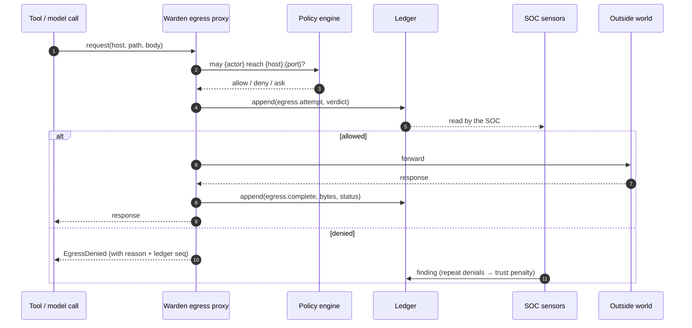
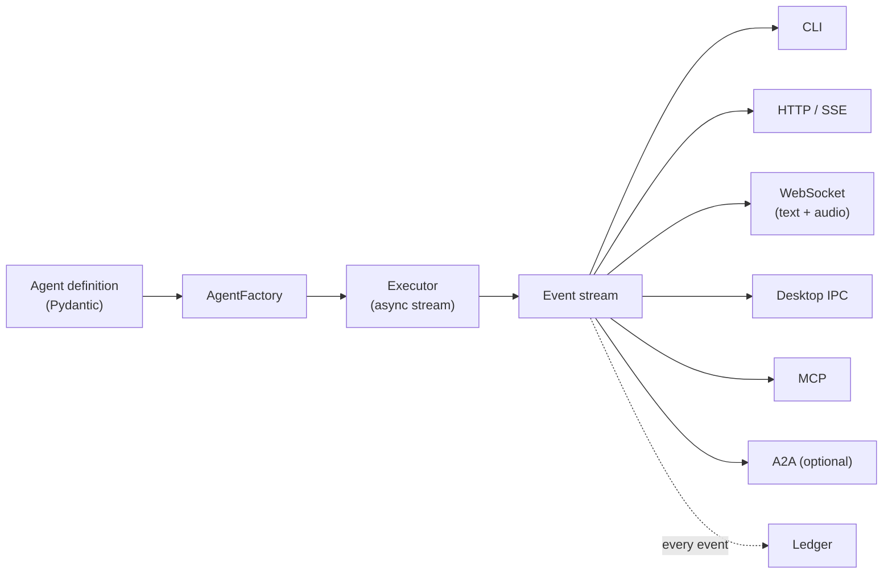

# Sletchy - Architecture

Read [principles.md](principles.md) first, and [LAW 0](00-do-no-harm.md) before that.
Everything here is a consequence of those.

**What Sletchy is:** a sealed personal enclave - a private network-and-compute bubble
with a SOC/NOC at its centre. It runs a local-first assistant that learns from every
interaction, and it watches, logs, and gates everything that happens inside itself,
including its own behaviour.

**What Sletchy is not:** a cloud platform, a multi-tenant service, or anything that
requires a cluster, a vendor, or a network connection to be useful.

---

## 1. The seven planes

```mermaid
flowchart TB
    subgraph bubble["THE BUBBLE (one host, one user)"]
        subgraph shell["SHELL - apps/"]
            desktop["desktop (Electron)<br/>hardened IPC only"]
            cli["cli"]
        end

        subgraph mind["MIND - the assistant"]
            harness["harness<br/>(stream-first executor)"]
            router["router<br/>(endpoint toggle)"]
            tools["tools"]
            mem["memory<br/>(learning loop)"]
            rag["rag"]
            graph["graph<br/>(temporal KG)"]
        end

        subgraph senses["SENSES - flagged off"]
            voice["voice"]
            vision["vision"]
            affect["affect"]
        end

        subgraph forge["FORGE"]
            ds["datasets"]
            bench["bench"]
            train["train (Unsloth)"]
        end

        subgraph vault["VAULT"]
            sc["contracts"]
            scaudit["audit"]
            backtest["backtest"]
        end

        subgraph soc["SOC / NOC - the nervous system"]
            sensors["sensors"]
            detect["detect + trust"]
            honey["honeypot"]
            noc["dashboard"]
        end

        subgraph warden["WARDEN - enforcement"]
            iso["isolation backends"]
            egress["egress proxy"]
            fsg["fsguard"]
            sup["supervisor"]
            supply["supply-chain vetting"]
        end

        subgraph kernel["KERNEL - trust root"]
            ledger["ledger<br/>(hash-chained)"]
            policy["policy engine"]
            caps["capabilities"]
            contracts["contracts (Pydantic)"]
            secrets["secrets"]
            flags["flags"]
        end
    end

    world(["outside world"])

    shell --> mind
    mind --> warden
    senses --> warden
    forge --> warden
    vault --> warden
    warden --> world
    warden --> kernel
    mind --> kernel
    soc --> kernel
    soc -.findings.-> kernel
    kernel -.entries.-> shell
```

**The two rules this diagram encodes:**

1. **Nothing reaches the outside world except through the Warden.** Not the Mind, not
   the Senses, not the Forge, not the Vault. One membrane, one chokepoint.
2. **Everything writes to the Kernel's ledger.** The SOC reads the ledger and writes its
   findings back to it; the Shell reads them there ([ADR-0011](../adr/0011-the-soc-is-a-bolt-on-and-reaches-the-shell-through-the-ledger.md)). The SOC is not a
   parallel logging system.

| Plane | Package | Owns | Trusts |
|---|---|---|---|
| **Kernel** | `sletchy.kernel` | Ledger, policy, capabilities, contracts, secrets, flags | Nothing. It *is* the trust root. |
| **Warden** | `sletchy.warden` | Isolation, egress, fs confinement, process supervision, dependency vetting | Kernel only |
| **SOC/NOC** | `sletchy.soc` | Sensors, detection, trust scoring, honeypot, dashboard | Kernel only (reads the ledger) |
| **Mind** | `sletchy.mind` | Harness, router, tools, memory, RAG, graph | Kernel + Warden |
| **Senses** | `sletchy.senses` | Voice, vision, affect | Kernel + Warden |
| **Forge** | `sletchy.forge` | Datasets, benchmarks, training, eval | Kernel + Warden |
| **Vault** | `sletchy.vault` | Contracts, audit, backtest, deploy | Kernel + Warden |
| **Shell** | `apps/` | Desktop, CLI | Talks to the Kernel and the Mind. Reads the SOC's findings from the ledger, never by importing it ([ADR-0011](../adr/0011-the-soc-is-a-bolt-on-and-reaches-the-shell-through-the-ledger.md)). Reaches the Warden only through its supervisor, which decides and records every launch (#52). Never the world directly. |

**Dependency rule, enforced by an import-linter test in CI:** planes depend downward
only. `kernel` imports nothing from Sletchy. `warden` imports only `kernel`. `soc`
imports only `kernel`, and nothing imports `soc`. `mind`/`senses`/`forge`/`vault` import
`kernel` + `warden`. The Shell (`cli`) imports `kernel`, `mind`, and the Warden's
supervisor only. Any
upward or sideways import fails the build.

---

## 2. The Kernel - trust root

The Kernel is small, boring, heavily tested, and rarely changed. It is the only thing
everything else is allowed to assume.

### The ledger

Append-only, hash-chained, signed.

```
Entry N:  { seq, ts_wall, ts_mono, plane, actor, action,
            subject, verdict, payload_hash, prev_hash, sig }
prev_hash = H(Entry N-1)
```

- **Hash-chained** - editing entry *k* invalidates every entry after it.
- **Signed** - signing key lives in the OS keychain, never in a config file.
- **Verified on startup** - a chain that does not verify means Sletchy refuses to run.
  It does not self-repair. (See [LAW 0 §7](00-do-no-harm.md).)
- **Sealed on rotation** - at 4 MB the segment is checked, then sealed with a terminal
  entry committing to the whole segment hash, and a new segment chains from it.
- **Opened by fingerprint** - an ordinary open checks each sealed segment against the hash
  its seal signed, and only the active segment entry by entry. `sletchy ledger verify`
  still checks every entry ([ADR-0009](../adr/0009-opening-the-ledger-checks-sealed-segments-by-fingerprint.md)).
- **One writer at a time** - every append holds an operating-system lock, released by the OS
  if its holder dies, and catches up with what another process wrote before it writes. Reads
  take no lock (#95).
- **Created only by setup** - every read path opens an existing ledger or says Sletchy is not
  set up where it looked; it never creates an empty one (#102).
- **An unfinished write is named** - a last line cut off by a crash is reported as a write
  that never finished. Still corruption, still a halt, still never repaired (#98).
- **Payloads are hashed, not necessarily stored.** Prompt and response bodies are
  content-addressed into a separate store so the chain stays small and so sensitive
  bodies can be dropped without breaking verification.

*Salvaged from GDN's `security/integrity.py` (HMAC-SHA256 sign/verify) - with the
per-node-ephemeral-key mistake its own audit report identified, corrected.*

### Policy, capabilities, flags

- **Policy** - declarative rules over (actor, action, subject) → allow/deny/ask, with
  the tighten-only merge from [principle #3](principles.md). Deny wins ties. An
  unparseable policy denies everything and raises.
- **Capabilities** - short-lived, scoped, signed grants bound to one execution context.
  Checked at the moment of use. Never cached into an assumption. A capability names
  exactly one action on exactly one subject class.
- **Flags** - one typed registry, defaults off for anything dangerous, ledger-logged on
  flip, generated into the UI.
- **Secrets** - refs only, resolved from the OS keychain at use time. Fail closed on
  missing. *This is the direct fix for the `os.environ.get(KEY, "gsk_live…")` pattern <!-- secret-scan: allow -->
  found in the old Sletchy config.*

---

## 3. The Warden - the only way out

### The isolation ladder (pluggable backends)

The single most important structural decision, and the answer to "what if a user
doesn't have Docker": **isolation is an interface with swappable backends.** Sletchy
degrades honestly instead of demanding a vendor.

| Backend | Substrate | Isolation | Requires | Use |
|---|---|---|---|---|
| `inproc` | Same process | **None** | - | Unit tests only. Refuses to load outside a test run. |
| `subproc` | Child process, env-whitelisted, timeout | Weak | - | Dev |
| **`winjob`** | **Job Object + restricted token + AppContainer.** The firewall app rule is #33, not built | **Strong for filesystem, resources and process tree** (measured, [ADR-0005](../adr/0005-appcontainer-findings.md)). **Not a network control** ([ADR-0006](../adr/0006-egress-binding-findings.md)) | **Windows only** | **Default on this host** |
| `container` | Docker/Podman: netns, read-only rootfs, cgroups | Strong by design, **not built** | Docker *or* Podman present | Opt-in accelerator |
| `vm` | Hyper-V isolated container | Strongest | Hyper-V | Future |

Backend selection is **declared, policy-tightened, and enforced** like everything else.
Policy may require a *minimum* backend for a given capability - e.g. "training may not
run below `winjob`", "any tool with egress requires `winjob` or better". A capability
whose minimum cannot be met **does not run**; it does not silently downgrade.

`container` is written against the OCI surface both Docker and Podman implement, so
"Docker" is never a hard dependency - that is the anti-lock-in guarantee, enforced by a
test that runs the container backend against Podman.

Full detail: [isolation.md](isolation.md). Rationale:
[ADR-0002](../adr/0002-pluggable-isolation-backends.md).

### The egress membrane

**Nothing in Sletchy makes an outbound connection directly.** Every plane's HTTP client
is a Kernel-provided client pointed at the Warden's local mediating proxy.



Two layers, deliberately independent:

- **L1 - Firewall app rule.** The sandboxed process is denied all direct network access
  at the OS level. It *cannot* bypass the proxy, even with attacker-controlled code.
- **L2 - Proxy allowlist.** Host, port, method, and size caps, checked per request.

L1 makes L2 non-bypassable; L2 makes L1 granular. Neither alone is enough.

Known gaps, stated honestly rather than implied-covered: DNS rebinding between check and
connect; cloud-metadata and RFC1918 addresses if an operator mis-adds them to an
allowlist; TLS-pinned traffic we terminate but do not deeply inspect. These are tracked
in `tests/adversarial/COVERAGE.md` under residual gaps.

### Supply-chain vetting

`warden/supply/` implements [principle #2](principles.md) for imports: hash-pinned
lockfile, license and CVE gate, transitive footprint report, and a **quarantine profile**
where a newly added dependency runs under the tightest backend while its actual
filesystem and network behaviour is profiled and diffed against what it declared.

---

## 4. The SOC/NOC - the nervous system

The SOC does not collect its own data. **It reads the ledger.** One source of truth,
therefore no possibility of the security view and the audit view disagreeing.

**It is a bolt-on, and the window reaches it only through the ledger**
([ADR-0011](../adr/0011-the-soc-is-a-bolt-on-and-reaches-the-shell-through-the-ledger.md)).
Nothing imports `sletchy.soc`. It observes, writes findings, and may only tighten. Raw
telemetry never goes on the ledger, only findings, so a busy machine cannot fill it. By
default it watches Sletchy's own processes; watching every process on the machine is a
dangerous flag, off by default.

| Component | Does |
|---|---|
| `sensors/` | **Built (#146): processes, ports, the System log and startup, on demand.** `sletchy-soc processes`, `network`, `events` and `startup` read the machine through query-only Windows APIs, unelevated, and name what is wrong as findings: a Windows program's name running from elsewhere, a database or remote-control port open to every network, a program in a user-writable folder listening beyond the machine, a service crash-looping, an unexpected shutdown, a startup entry whose program is gone, a task with administrator rights at every logon. The startup reader is the one file allowed to name the startup keys ([ADR-0012](../adr/0012-the-soc-may-read-what-starts-with-the-machine.md)). What an ordinary user cannot open is counted, not guessed. Planned: ETW events, ledger entries as signals |
| `detect/rules/` | Deterministic rules: denied-egress bursts, new-host-first-contact, capability escalation attempts, prompt-injection markers, anomalous tool sequences |
| `detect/trust.py` | **Trust score 0–100 per actor**, clamped, moves on evidence. Capabilities gate on thresholds. *Salvaged from GDN's `AIAgent.trust_score` - the best single idea in that repo, promoted from a field into a control.* |
| `honeypot/` | Decoy surfaces: fake credential files, decoy tools in the registry, tarpit listeners, a plausible fake "admin" endpoint. Any touch is a **high-confidence** signal - nothing legitimate ever touches a decoy. **Loopback-bound by default** ([LAW 0 §4](00-do-no-harm.md)). |
| `rollups/` | Hourly → daily → weekly → monthly digests, each itself a ledger artifact |
| `noc/` | Live dashboard: traffic, denials, trust scores, honeypot hits, resource use |

**Why a honeypot is worth it here:** in a single-user bubble the false-positive rate of
"something touched the decoy" is essentially zero. That makes it one of the few
detections that can safely trigger an *automatic* response - freeze the actor, revoke
its capabilities, snapshot state, alert. Detection quality, not volume.

---

## 5. The Mind - the assistant

### The harness: one stream, many hosts



Hosts are pure translation - no state, no side effects. The executor never knows the
wire format; the host never knows the runtime.

**Event vocabulary** (extend payloads before adding types):
`CONTENT` · `REASONING` · `TOOL_CALL` · `TOOL_RESULT` · `INTERRUPT` · `ARTIFACT` ·
`PLAN` · `STATUS` · `POLICY` · `COMPLETE` · `ERROR`

`POLICY` is Sletchy's addition to the inherited vocabulary: a decision was made about
this execution - allowed, denied, tightened, escalated - carrying the ledger sequence
number. It exists so **every surface can show the security story inline with the
conversation**, which is the whole point of a self-contained SOC. You see *why* Sletchy
refused, in the same stream as the refusal.

### The router - endpoint toggling

Four entities:

**Provider** (ollama, groq, gemini, huggingface, openai-compatible, llama.cpp) →
**Endpoint** (concrete base URL + auth ref + defaults) → **CatalogEntry** (a model
reachable through that endpoint, with capabilities and limits) → **Binding** (an
immutable snapshot of what an execution actually resolved to).

You toggle at any level: swap the endpoint under an agent without touching the agent;
pin a benchmark to an exact binding; force everything local by disabling every non-local
endpoint with one flag. **Every endpoint is a distinct egress destination**, so switching
providers is a policy event, not a config detail.

Per-model rate limiting (RPM/RPD/TPM/TPD with computed wait times) is salvaged and
rebuilt from the old Sletchy `RateLimiter`, whose 14-model Groq limit table carries over
as seed data.

### Memory - the learning loop

This is the "learn from every interaction, evolve to the user's needs" requirement, made
concrete:

```
interaction ──▶ episodic (every turn, content-addressed)
                    │
                    ├──▶ hourly digest   ── what happened, what was asked, what failed
                    ├──▶ daily rollup    ── themes, recurring needs, friction points
                    ├──▶ weekly          ── habit and preference deltas
                    └──▶ monthly         ── the user model: goals, style, standing prefs
```

Each rollup is a **ledger artifact** - auditable, diffable, and reversible. You can read
exactly what Sletchy concluded about you, when, and from which interactions. Rollups
feed retrieval and prompt assembly; nothing is inferred that cannot be traced.

The old `MemoryManager` had the right instinct (archival at 1000 entries,
`summarize_recent()`); it was a full-CSV-rewrite-per-write with substring matching. The
rebuild is append-only + content-addressed + embedding-backed, sharing the ledger's
storage discipline.

### RAG and the graph

`mind/rag/` is a **`Strategy` protocol** with the 21 catalogued techniques as named,
flag-gated implementations - so they can be benchmarked against each other on your own
corpus by `forge/bench/`. That is the honest way to learn RAG trade-offs: measure them.

Seeded by ElectronAPP1's genuinely good work - BM25 over sentence chunks (fully local,
zero egress) and multi-granular ingestion (semantic/paragraph/page/chapter/`auto`).

`mind/graph/` is a **temporal** knowledge graph - facts carry validity intervals, so
Sletchy knows what *was* true and when it changed, not just what is true. Entities,
relations, communities, community summaries. From TalkyTime's Graphiti approach plus
ElectronAPP1's GraphRAG-lite, with the entity-validation stopword filtering that made
its graphs usable.

---

## 6. Senses, Forge, Vault

**Senses** - all flag-gated off, all emit a ledger event and a visible indicator when
active. `voice/` (wake word, STT, TTS, sentence chunking, barge-in as `INTERRUPT`) from
project42 + TalkyTime. `vision/` (YOLO + Depth-Anything-V2 fusion, debounced tracking)
from your existing work. `affect/` - the emotional classifier - lands via PR with your
friend's model behind its own flag, treated as an untrusted third-party model with its
own capability profile.

**Forge** - `datasets/` (build, clean, Kaggle loaders, provenance-tracked),
`bench/` (any endpoint × any eval set → ledger-recorded results; seeded by your COBOL
mainframe leaderboard as the first regression baseline), `train/` (Unsloth as a pinned
dependency, never a fork; runs are capped and flag-gated per [LAW 0 §5](00-do-no-harm.md)),
`eval/`. Sletchy owns the dataset, config, and run record; Unsloth owns the kernels.

**Vault** - `contracts/` on OpenZeppelin as a versioned dependency, `audit/` (Slither +
Mythril adapters, findings into the ledger), `backtest/` (forked-chain simulation),
`deploy/` (**testnet by default; mainnet requires a second human confirmation naming the
chain and the value at risk** - [LAW 7](laws.md#law-7)). The scraped Solidity corpus from
original Sletchy becomes the first `forge/datasets/` input, which is how the
train-on-contract-data goal gets started.

---

## 7. Repository layout

```
docs/
  LAW/          principles, architecture, isolation, laws, sources - read first
  adr/          decisions with reasoning, numbered, superseding
  salvage/      inventory of Scraps and Parts + credentials to rotate
  roadmap/      waves
src/sletchy/
  kernel/       ledger, policy, capabilities, contracts, secrets, flags, clock
  warden/       isolation/, egress/, fsguard/, supervisor/, supply/
  soc/          sensors/, detect/, honeypot/, rollups/, noc/
  mind/         harness/, router/, tools/, memory/, rag/, graph/, agents/
  senses/       voice/, vision/, affect/
  forge/        datasets/, bench/, train/, eval/
  vault/        contracts/, audit/, backtest/, deploy/
apps/
  cli/          the sletchy command, incl. `sletchy stop`
  desktop/      Electron - contextIsolation, sandbox, no nodeIntegration, IPC only
tests/
  unit/         per-module
  adversarial/  attack → test matrix (COVERAGE.md), incl. test_law_zero.py
  e2e/          full-bubble scenarios
config/         typed config + policy files
var/            ALL runtime state. The only directory Sletchy writes to.
scripts/        dev tooling
Scraps and Parts/   READ-ONLY archaeology. gitignored. Never written to.
```

---

Related: [LAW 0](00-do-no-harm.md) · [principles.md](principles.md) ·
[isolation.md](isolation.md) · [laws.md](laws.md) ·
salvage inventory
